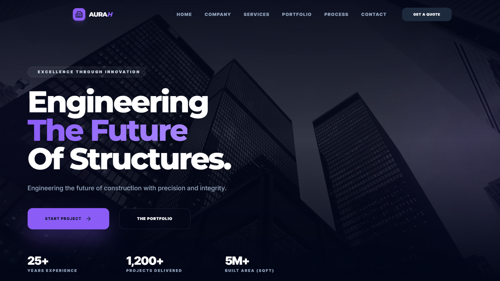
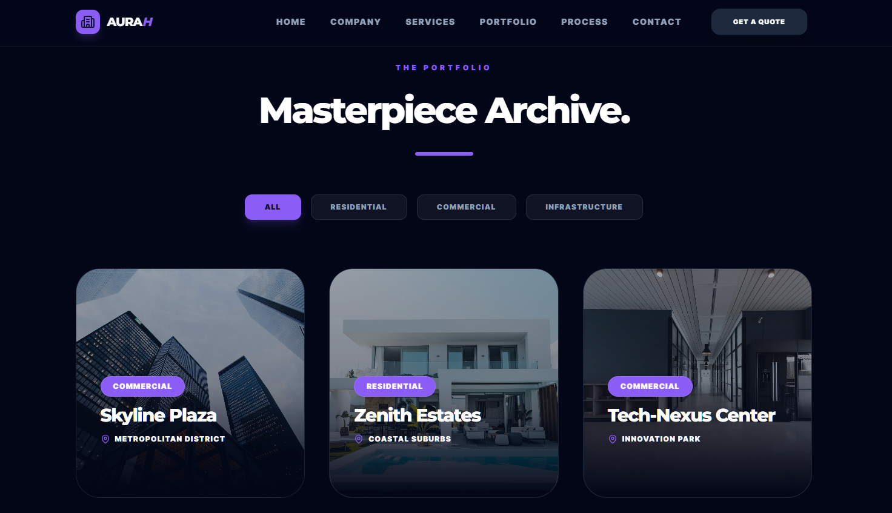
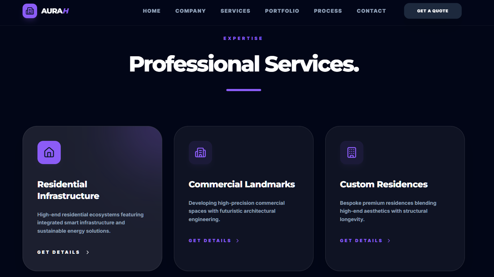
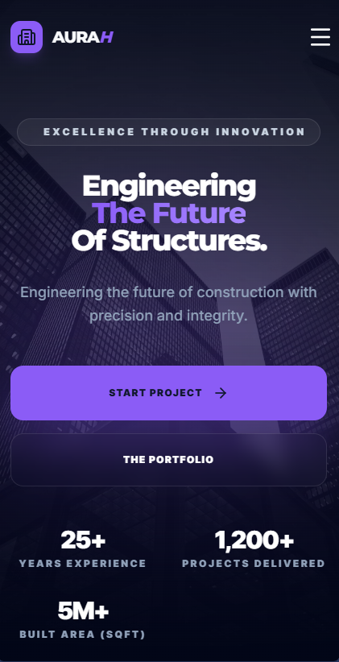

# AuraH | Premium Structural Engineering & Construction

A high-performance, responsive construction website template built with a Modern Noir aesthetic. Designed for structural engineering firms and construction management professionals who prioritize technical precision and digital excellence.

[View Live Demo](https://aurah-construction-website.pages.dev/)

---

## The Showcase

### Immersive Digital Presence
The Hero section utilizes dynamic gradients and high-contrast typography to establish an immediate sense of scale and authority.

### Intelligent Portfolio Filtering
Advanced structural archive featuring a seamless category filtering system for Residential, Commercial, and Infrastructure projects.

### Precision Engineering Methodology
A modular bento-style services grid and vertical roadmap that transparently communicates the technical lifecycle of every build.

---

## Key Highlights

- **Aesthetic Excellence**: A curated "Modern Noir" theme using deep slate palettes and electric violet accents.
- **Modular Data Architecture**: Content is decoupled from UI logic, allowing for rapid deployment and updates.
- **Dynamic Snapshots**: High-impact business metrics section detailing technical staff, built area, and project volume.
- **Premium Performance**: Built on Vite for near-instant load times and buttery smooth interaction states.
- **Contact Integrated**: Glassmorphism-styled enquiry system designed for high conversion.

---

## Seamlessly Mobile

Optimized for the full range of modern devices. Whether viewed on a 4K monitor or a smartphone, the visual hierarchy and structural integrity of the design remain uncompromising.

---

## Built With

- **Vite + React**: The core engine for modern, efficient frontend development.
- **Tailwind CSS**: Utility-first styling for precise control over the design system.
- **Lucide Icons**: A library of crisp, professional iconography for a technical look.
- **Modular JavaScript**: Clean, reusable component architecture.

---

## Purpose

AuraH was developed to bridge the gap between heavy-duty engineering and high-end digital design. It serves as a definitive template for professional firms looking to showcase technical legacy without sacrificing modern aesthetic standards.

---
© 2026 AuraH. Professional Structural Archive.

